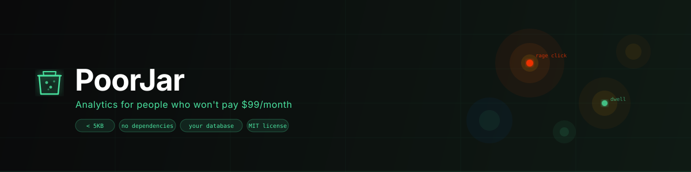

<!--
  README for PoorJar.
  No em dashes. Anywhere. Ever.
  No AI slop. Write like a human.
-->

<p align="center">
  
</p>

<p align="center">
  <a href="https://github.com/hratterman/poorjar/stargazers"></a>
  
  
  
  
</p>

<p align="center">
  <b>Hotjar for the rest of us.</b><br/>
  Free, open-source session analytics. One script tag. Bring your own backend.
</p>

<p align="center">
  <i>Built by <a href="https://henryratterman.com">Henry Ratterman</a>, a marketing major at Indiana University who needed heatmaps and wasn't paying $99/month for them.</i>
</p>

<p align="center">
  <a href="#quick-start">Quick start</a> ·
  <a href="#backends">Backends</a> ·
  <a href="#dashboard">Dashboard</a> ·
  <a href="#what-it-tracks">What it tracks</a> ·
  <a href="#public-api">Public API</a> ·
  <a href="https://poorjar.com">poorjar.com</a>
</p>

---

## What it is

PoorJar is a lightweight analytics script that tracks how people actually use your site. Click heatmaps, scroll depth, rage clicks, dwell spots. Under 5KB, no external dependencies, works anywhere you can paste a `<script>` tag.

The difference from Hotjar: you own your data. Every event goes directly from your visitor's browser to your own database. PoorJar.com never sees it.

---

## Quick start

Paste this before `</body>`. Use the [setup wizard](https://poorjar.com/#setup) to generate yours automatically.

```html
<script
  src="https://poorjar.com/poorjar.js"
  data-endpoint="https://YOUR_PROJECT.supabase.co/rest/v1/poorjar_events"
  data-site-id="your-site-id"
  data-mode="supabase"
  data-key="your-anon-key"
></script>
```

> **No `async` or `defer`.** PoorJar reads `document.currentScript` at parse time to find its config. Async loading breaks this. The setup wizard generates the correct tag automatically.

That is the entire installation. No npm. No build step. No account.

---

## Backends

Pick one. The wizard walks you through whichever you choose.

| Backend | What you need | Data goes to |
|---|---|---|
| **Supabase** | Free project, one SQL command | Your Supabase project |
| **Google Sheets** | A published Apps Script web app | Your Google Sheet |
| **Custom webhook** | Any endpoint that accepts POST JSON | Wherever you want |

### Supabase setup

Create a free project at [supabase.com](https://supabase.com), then run this in the SQL editor:

```sql
create table poorjar_events (
  id          bigint generated always as identity primary key,
  site_id     text,
  session_id  text,
  type        text,
  x           integer,
  y           integer,
  vx          integer,
  vy          integer,
  vpw         integer,
  vph         integer,
  depth       real,
  scroll_y    integer,
  timestamp   bigint,
  url         text
);

alter table poorjar_events enable row level security;
create policy "allow insert" on poorjar_events for insert with check (true);
```

That's it. Your anon key goes in `data-key`, your project URL goes in `data-endpoint`.

---

## Dashboard

The analytics dashboard lives at [poorjar.com/dashboard](https://poorjar.com/dashboard).

**What it shows:**
- Click heatmap overlaid on a live preview of your actual site
- Dwell heatmap (where people stop and read)
- Scroll depth bar
- Session list with timestamps, URLs, and event breakdowns
- Rage click flags
- Page-by-page filtering

Everything runs in your browser. Your Supabase credentials go directly from you to Supabase. PoorJar.com is not in that loop.

**Self-hosting:** [Download the dashboard](https://poorjar.com/dashboard/index.html) as a single HTML file and host it anywhere, or just open it locally. No server, no dependencies. It's one file.

After connecting once, the setup wizard generates a pre-connected dashboard URL you can bookmark. One click, straight to your data.

---

## What it tracks

| Event | When | Fields |
|---|---|---|
| `click` | Every click on the page | `x`, `y`, `vx`, `vy`, `vpw`, `vph`, `url` |
| `rage_click` | 3+ clicks within 600ms and 60px radius | same as click |
| `scroll` | Once each at 25%, 50%, 75%, 100% depth | `depth`, `scroll_y`, `url` |
| `dwell` | Mouse pauses 500ms+ in the same 30px area | `x`, `y`, `vx`, `vy`, `url` |

**Coordinate system:** `x/y` are page-absolute (from the top of the document, so they're consistent across scroll positions). `vx/vy` are viewport-relative (where on the screen the event happened).

**Flushing:** Events are batched and sent every 5 seconds, and again on tab close / page navigation. If you close a tab immediately after clicking something, the flush fires via `pagehide`.

---

## Data format

Each event is a flat JSON row (Supabase mode):

```json
{
  "site_id": "your-site-id",
  "session_id": "abc123def456",
  "type": "click",
  "x": 540,
  "y": 320,
  "vx": 540,
  "vy": 120,
  "vpw": 1440,
  "vph": 900,
  "depth": null,
  "scroll_y": null,
  "timestamp": 1747000000000,
  "url": "https://yoursite.com/page"
}
```

All 13 fields are always present. Missing fields are `null`. This is required by PostgREST, which rejects batches with inconsistent keys.

---

## Public API

After loading, PoorJar exposes a small API on `window.PoorJar`:

```js
PoorJar.flush()
// Force an immediate send of queued events.
// Useful for single-page apps that navigate without a page unload.

PoorJar.getQueue()
// Returns a copy of events queued but not yet sent.
// [ { type: 'click', x: 540, y: 320, ... }, ... ]

PoorJar.stats()
// Returns { flushCount: 3, totalSent: 47, queued: 2 }
```

PoorJar also fires two custom DOM events you can listen to:

```js
document.addEventListener('poorjar:event', (e) => {
  console.log('event queued:', e.detail);
});

document.addEventListener('poorjar:flush', (e) => {
  console.log('flushed:', e.detail.count, 'events | total sent:', e.detail.totalSent);
});
```

These are useful for building debug overlays, test consoles, or custom integrations.

---

## How it handles hostile pages

PoorJar is designed to work even when the page fights it.

**`stopPropagation`:** All three event listeners (`click`, `scroll`, `mousemove`) attach with `capture: true`, so they run before any page-level handlers and can't be blocked by `stopPropagation` in bubbling phase.

**Synthetic clicks:** PoorJar tracks all clicks at the document level, including ones fired programmatically via `.click()` or `dispatchEvent`.

**Dynamic DOM:** PoorJar doesn't observe DOM mutations. It attaches once at the document level and stays there regardless of what the page renders or removes afterward.

**Single-page apps:** If your SPA navigates without a page unload, call `PoorJar.flush()` on route change so queued events include the correct URL.

---

## SPA / route change support

If you're on React, Vue, Next.js, etc., flush on route change:

```js
// React Router example
import { useEffect } from 'react';
import { useLocation } from 'react-router-dom';

function Analytics() {
  const location = useLocation();
  useEffect(() => {
    if (window.PoorJar) window.PoorJar.flush();
  }, [location]);
  return null;
}
```

---

## Size

```
poorjar.js (unminified)   ~4.2 KB
poorjar.js (gzipped)      ~1.8 KB
```

No external requests. No fonts. No images. No third-party anything.

---

## Privacy

PoorJar does not collect:

- IP addresses
- User agents
- Cookies or fingerprints
- Any personally identifiable information

It collects: where people clicked, how far they scrolled, and where they paused. That's it. You decide where that data goes and who can see it.

---

## Self-hosting poorjar.js

If you don't want to load the script from poorjar.com, serve it yourself:

```html
<script
  src="/your/path/to/poorjar.js"
  data-endpoint="..."
  data-site-id="..."
  data-mode="supabase"
  data-key="..."
></script>
```

The script has no hardcoded URLs. It reads everything from `data-*` attributes.

---

## License

[MIT](LICENSE). Fork it, self-host it, white-label it. That's the point.

---

<p align="center">
  Built by <a href="https://henryratterman.com">Henry Ratterman</a> in Bloomington, Indiana<br/>
  <sub>Marketing major. Builds things anyway. Also built <a href="https://callphony.ai">Phony</a> and <a href="https://arduous.io">Arduous</a>.</sub>
</p>
